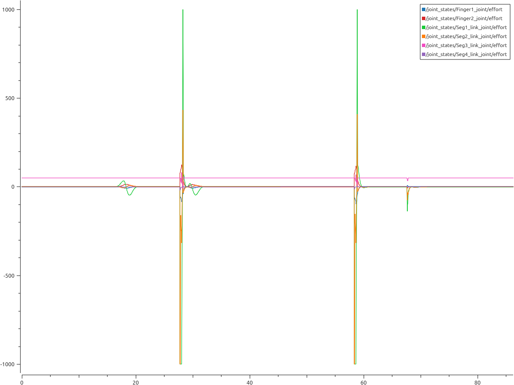
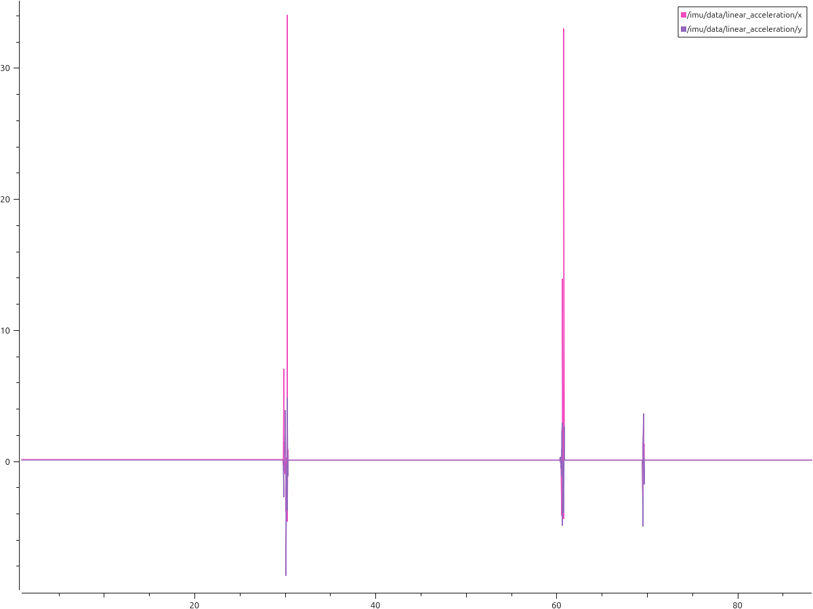
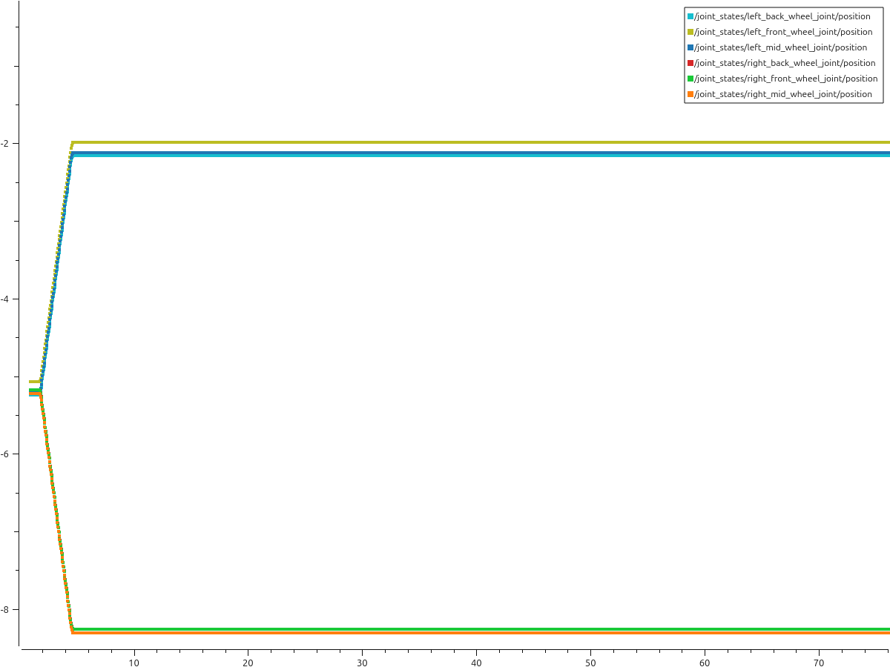

# Modelado Y Simulacion - Integración y estudio de dinámicas en Gazebo y ROS2

Para la practica 3 de la asignatura de Modelado y Simulacion se pedia integrar el rover, creado en blender de la practica 2, en Gazebo y ROS2.
Para ello se ha divido la practica en dos partes, en la primera se pedia configurar correctamente el modelo de robot para poder ser visualizado,
operado y controlado usando el software disponible en ROS 2.
En la segunda parte se pedia realizar el análisis de coste del mecanismo pick and place 
en el simulador Gazebo mediante el framework de MoveIt2.

## Instrucciones de ejecucion y uso
Para la ejecucion de esta practica es necesario una serie de pasos que se deben de seguir en orden
1. **Configurar el entorno de ROS 2 y el workspace**

    Este paso debe realizarse en 3 terminales distintas, en cada una ejecutando uno de los siguientes
    pasos.
   - Instalar ROS 2 Jazzy.
   - Crear y compilar el workspace con `colcon build --symlink-install`
   - Sourcing del entorno: `source install/setup.bash` desde el directorio modelado-ws.

2. **Lanzar el rover, junto con Gazebo y RVIZ2**
    - En este paso lanzaremos el rover, junto con Gazebo y RVIZ2, pasando como argumento el mundo 
    que queremos lanzar en Gazebo.
    ```bash
    ros2 launch roverto_description robot_gazebo.launch.py world_name:=urjc_excavation_msr
    ```

3. **Lanzar el move_group de MoveIt2**
    ```bash
    ros2 launch roverto_moveit_config move_group.launch.py
    ```

4. **Lanzar los controladores que se usan en el rover**
    ```bash
    ros2 launch roverto_description robot_controllers.launch.py
    ```

5. **Usar el motion planner de RVIZ**

    Para poder mover el brazo debemos de usar el motion planner que hay como plugin en 
    RVIZ, debemos de tener siempre como planificador OMPL, para que funcione, ademas
    es prefible primero planificar y luego ejecutar que hacer las dos cosas a la vez para 
    un mejor funcionamiento.

## Explicacion de Graficos generados

En esta practica se debia de generar 3 graficas que mostrasen la posicion de las 
ruedas vs tiempo, la aceleracion vs tiempo, y el gasto de cada articulacion involucrada
en el Pick and Place vs tiempo.

### Grafica gasto parcial vs tiempo


En esta grafica podemos ver el gasto de cada articulacion que participa en el 
movimiento Pick and Place, como se vera mas adelante, los picos de gasto, correspondientes
a movimientos grandes o bruscos, coincidiran con los picos de la grafica de aceleracion.

Para poder distinguir mejor cada una de las articulaciones he separado esta grafica 
en dos, una grafica con el gasto del brazo scara, y otra grafica con el gasto de los dedos
del gripper.

#### Grafica gasto parcial scara vs tiempo
2.png)
En esta grafica se muestra el gasto del brazo scara durante la maniobra de Pick and Place.
Comenzando con la primera articualcion marcado en verde, esta articualcion es la que mayores picos
de esfuerzo alcanza puesto que debe de hacer grandes movimientos ademas de que debe de 
mover el peso del resto del brazo, y aquello que sujeta.

La segunda articualcion del brazo tiene un comportamiento similar a la primera, pero 
con unos picos ligeramente menores puesto que no debe de sujetar su propio peso.
Estos dos segmentos como se puede ver en la grafica normalmente hacen movimiento
grandes y de gran esfuerzo, esto se puede ver en los dos picos de esfuerzo de la grafica
estos se deben a que el brazo se esta desplazando de atras del rover a adelante, 
y el segundo pico se debe a que el brazo se esta desplazando de adelante a atras.

En cuanto a la tercera articualcion, marcado en rosa, este se trata de la articulacion 
prismatica, esta durante casi la totalidad del movimiento esta realizando un esfuerzo
constante, esto se debe a que esta articualcion esta hacia arriba para no arrastrar 
el gripper, y por tanto debe de hacer un esfuerzo constante para que no caiga.
Los cambios que se pueden ver se deben a; breve momento donde el segmento debe de 
bajar para coger el cubo.

Por ultimo, la cuarta articulacion se trata de la muñeca, esta articualcion realiza
solo movimientos pequeños para orientar el gripper correctamente, es por esto que
no realiza grandes esfuerzos.

#### Grafica gasto parcial gripper vs tiempo
2.png)
En esta grafica se muestra el gasto de las articulaciones del gripper, es decir de 
los dos dedos. 

Lo primero que podemos notar es que la grafica de ambas articulaciones es simetrica 
respecto al eje X, es decir lo que hace una, la otra hace exactamente lo contrario.
Durante la mayoria del tiempo estar articulaciones no deben de hacer ningun esfuerzo,
puesto que estan en la posicion de reposo, gripper abiero, los pequeños esfuerzos 
que vemos se realacionan a movimentos que el brazo realiza y que puede afectar al 
gripper lo que provoca que la articualcion deba de hacer esfuerzo para mantener dicha
posicion. En cuanto a los picos grandes de esfuerzo, estos se deben a el cerrado 
y apertura del gripper, el primer pico correspondiente al cerrado, y el segundos 
a la apertura.

### Grafica aceleracion vs tiempo


En esta grafica se muestra la aceleracion registrada por la imu en el eje X e Y.
Durante gran parte del movimiento no vemos aceleracion pues el rover permanece 
quieto, es solo cuando se realizan moviementos grandes del brazo que se registran
aceleraciones, podemos saber esto porque los picos de aceleracion coinciden 
temporalmente con los picos de esfuerzo del brazo.

### Grafica posicion vs tiempo



En esta grafica podemos ver la posicion de cada una de las seis ruedas, como se puede apreciar,
al principio hay un cambio de posicion de cada una de las ruedas, esto se explica 
porque el rover al principio se reubica para estar en la posicion correcta para coger el cubo.
Tras este movimiento, el rover no vuelve a moverse de us posicion pues no es necesario.

## Descarga de Rosbag usado
Para descargar el rosbag se usa DownGit, sin embargo algunos buscadores pueden llegar a detectar esta pagina como un intento de instalar malware en el ordenador 
del usario, en este caso bastaria con ignorar el aviso y continuar a la pagina.
[Descargar rosbag](https://minhaskamal.github.io/DownGit/#/home?url=https://github.com/adrinava12/Modelado-Y-Simulacion/tree/main/rosbags/rb_modelado_final)
